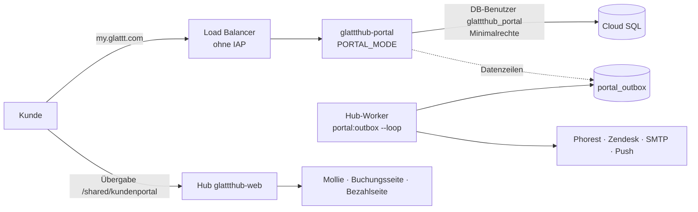

# Kundenportal (my.glattt.com)

!!! info "Stand 01.10.2026"
    Etappen 1–4 und die Büro-Seite sind auf Prod, aber noch nicht erreichbar: my.glattt.com landet
    bis zur Einrichtung des eigenen Dienstes (siehe [Betrieb](#betrieb-einrichtung)) bei der
    Google-Anmeldung. Einladungen sind aus (`PORTAL_INVITATIONS_ENABLED=false`), bis die
    Rechtstexte vom Anwalt zurück sind. Die Klickanleitung zur Büro-Seite ist geplant.

## Für Endanwender

Vertragskunden bekommen mit ihren Vertragsunterlagen einen Einladungslink. Sie legen ein Passwort
fest, stimmen Nutzungsbedingungen und Datenschutzhinweisen zu und sehen danach:

- **Start:** nächster Termin und Fortschritt je Behandlungszone
- **Termine:** kommende und vergangene Termine mit Sitzungsbestätigung; verlegen bis 24 Stunden vorher
- **Vertrag:** bezahlt/offen je Vertrag, Raten, Einmalzahlung (beliebiger Betrag, auch Apple Pay),
  neue Bankverbindung mit unterschriebenem SEPA-Mandat, offene Forderungen bezahlen, Unterlagen als PDF
- **Kontakt:** Nachricht an den Kundenservice (Zendesk) oder WhatsApp ans Institut
- **Profil:** Zustimmungsbelege, Passwort ändern, Konto löschen

Im Hub erledigt das Büro unter **Betrieb → Kundenportal** die Aufträge, die daraus entstehen:
Einmalzahlungen von hinten auf die Raten verteilen, neue Bankverbindungen übernehmen oder ablehnen,
nicht zugestellte Nachrichten erneut senden, Konten sperren und Einladungen neu senden. Zu jedem
Auftrag kommt eine Mitteilung (Modul „Kundenportal“ im Benachrichtigungs-Katalog). GoCardless wird
dabei nie automatisch angefasst.

Seit 02.10.2026 ist die Büro-Seite ein **Posteingang mit Kontext** (Entwurf A). Er steht im Web und
nativ in der glatttHub-App auf iPhone und iPad. Zu jedem Auftrag zeigt die Seite Restbetrag, nächste
Rate und offene Forderungen. Bei Bankverbindungen steht die bisherige neben der neuen, dazu kommen
automatische Prüfpunkte. Abgelehnt wird mit Grund, und die Kundin erfährt ihn auf Wunsch per E-Mail
und Mitteilung. Erledigtes bleibt 30 Tage im Reiter „Erledigt“ sichtbar, Konten lassen sich durchsuchen.
Die Zahl offener Aufträge steht am Menüpunkt.

## Für Entwickler

### Büro-Seite „Posteingang mit Kontext“ (02.10.2026)

- **Endpunkte** (Recht `manage_customer_portal`, Übernehmen/Verteilen zusätzlich `manage_gocardless`):
  `GET /hub/kundenportal/data` (Aufträge mit `context`, `previous`, `checks`, dazu `reject_reasons`),
  `GET /hub/kundenportal/verlauf?q=` (30 Tage), `GET /hub/kundenportal/konten?q=&status=&page=` (50 je Seite).
  Dieselben Endpunkte nutzt die native Seite (`ios/glatttHub/CustomerPortal/`).
- **Prüfpunkte** (`PortalOfficeService::mandateChecks`): IBAN-Prüfsumme, gleiche IBAN wie bisher,
  Kontoinhaber:in = Kundin bzw. abweichender Zahler, Unterschrift vorhanden, Rate in den nächsten 5 Tagen
  (könnte noch übers alte Konto laufen). Die Punkte sind nur Hinweise und sperren nichts.
- **Ablehnen**: `reason` (`signature`/`holder`/`iban`/`other`) + optional `note`; Text aus
  `PortalOfficeService::REJECT_REASONS` geht an die Kundin, wenn `notify` gesetzt ist — Mail-Vorlage
  `bank_rejected` (Admin „Kunden-App · E-Mails“) und Push-Anlass `bank_rejected` (wichtig, kommt
  immer; wie alle Anlässe zunächst **aus**).
- **Zahl am Menüpunkt**: `PortalOfficeService::openCount()` (60 s Cache, nach jeder Aktion verworfen),
  als Komponente `<x-customer-portal-badge />` — ein `@if` im Gruppen-Markup der Seitenleiste bricht
  `SidebarNavGroupTest`.

### Architektur: eigener Dienst ohne Fremdschlüssel

Entscheidung Jan 01.10.2026: *„Mir ist Sicherheit sehr wichtig. Kein Einfallstor bieten!“* Das
Portal läuft deshalb als **eigener Cloud-Run-Dienst `glattthub-portal`** aus demselben Image wie der
Hub, gestartet mit `PORTAL_MODE=true` und `/entrypoint-portal.sh` (ohne Migrationen).

| | Hub (`glattthub-web`/`-worker`) | Portal (`glattthub-portal`) |
|---|---|---|
| Routen | alles | nur `portal.*` und `/up` |
| DB-Benutzer | `glattthub_user` | `glattthub_portal` (Grants unten) |
| `APP_KEY` | Hub | eigener (`portal-app-key`) |
| `PORTAL_DATA_KEY` | ja | ja (`portal-data-key`) |
| Phorest, Mollie, Zendesk, SMTP, GoCardless, Push | ja | **nein** |
| Sitzungen/Cache | `sessions`/`cache` | `portal_sessions`/`portal_cache` |
| Warteschlange | `jobs` | keine (`queue.default = null`) |

**`App\Support\PortalMode`** setzt im Portal-Modus die Laufzeit-Konfiguration im Code (nicht über
Env, damit sie nicht falsch gesetzt werden kann) und entfernt nach dem Start jede Route, die nicht
`portal.*` heißt — auch, was Pakete selbst anmelden (Livewire, Sanctum, `storage/{path}`).
`bootstrap/app.php` lädt im Portal-Modus nur `routes/portal.php`, `bootstrap/providers.php` lässt das
Filament-Panel weg. `PortalServiceIsolationTest` startet `route:list` im Portal-Modus in einem eigenen
Prozess und bricht bei jeder fremden Route.

**`PortalHostGate`** (global): im Portal-Dienst nur Portal-Routen; im Hub auf Prod werden
Portal-Routen gar nicht bedient (sie bleiben nur für `route()` registriert, z. B. Links in Mails),
lokal und auf Staging liefert der Hub das Portal zum Testen selbst aus.

### Wie das Portal ohne Schlüssel auskommt

1. **Auftragsbuch `portal_outbox`** — das Portal schreibt reine Datenzeilen, der Hub-Worker
   (`portal:outbox --loop`, Programm in `docker/supervisord-worker.conf`) arbeitet sie ab
   (`PortalOutboxProcessor`):

    | Typ | Auslöser im Portal | Hub tut |
    |---|---|---|
    | `contact` | Nachricht senden | Zendesk-Ticket; bei Fehler Aufgabe + Mitteilung fürs Büro |
    | `password_reset` | „Passwort vergessen“ mit passendem Geburtsdatum | Mail mit Link; Klartext-Link danach aus der Zeile gelöscht |
    | `refresh` | Kopie älter als 10 Minuten | Profil + Termine aus Phorest, maskierte IBAN, fehlende PDFs |
    | `pdf` | PDF fehlt noch | PDF erzeugen |
    | `mandate_requested` | neue Bankverbindung | Mitteilung ans Büro |

    Jede ID im `payload` muss zum Konto der Zeile gehören, sonst wird der Auftrag verworfen
    (`error`). Aufträge werden atomar übernommen (`attempts`), nach 5 Fehlversuchen `failed`.
    **Nie die gemeinsame `jobs`-Tabelle aus dem Portal** — serialisierte Jobs würden im Hub-Worker
    entpackt und könnten dort Code ausführen.

2. **Übergaben im Browser** (`PortalHandoffService`, `Shared\PortalHandoffController`):
   Das Portal leitet den Kunden auf den Hub weiter, der erst nach eigener Prüfung handelt.
    - `/shared/kundenportal/zahlung/{uuid}` — Einmalzahlung: Betrag ≤ offene SEPA-Raten (neu
      gerechnet), Vertrag gehört zum Kunden, höchstens 15 Minuten alt → Mollie-Kasse. Rückkehr auf
      `my.glattt.com/zahlung/{uuid}`; den Status trägt der Mollie-Webhook im Hub ein
      (`ProcessPortalPaymentJob` → `PortalHandoffService::sync`).
    - `/shared/kundenportal/{uuid}` — `reschedule` (Termin live in Phorest geprüft →
      `BookingShareToken` mit `source=portal`) oder `debts` (Sammel-Bezahllink wie im
      Forderungsmanagement). Einmalig, 15 Minuten gültig.

3. **Kopie am Konto** (`PortalSnapshotService`, nur im Hub): `customer_accounts` trägt `first_name`,
   `last_name`, `gender`, `customer_number`, `home_branch_id`, `birth_date_hash` (HMAC des
   Geburtsdatums mit dem Datenschlüssel — das Portal vergleicht nur Prüfwerte) und `snapshot`
   (Termine, `iban_masked` je Vertrag). Beim Einladen wird das Profil sofort angelegt.

### Datenmodell

| Tabelle | Zweck |
|---|---|
| `customer_accounts` | Konto je Phorest-Kunde (Guard `customer`), Profil und Kopie (s. o.) |
| `customer_invitations` | Einladungslinks (Hash), 14 Tage, einmalig |
| `customer_password_resets` | Reset-Links (Hash), 30 Minuten |
| `portal_legal_documents` / `customer_consents` | Fassungen der Rechtstexte und Zustimmungsbelege |
| `portal_contact_requests` | Nachrichten an den Kundenservice |
| `portal_payments` | Einmalzahlungen (Mollie), `applied_at` = vom Büro verteilt |
| `portal_mandate_requests` | neue Bankverbindungen; IBAN, Inhaber, Unterschrift mit `PortalEncrypted` |
| `portal_outbox` | Auftragsbuch Portal → Hub |
| `portal_sessions`, `portal_cache`, `portal_cache_locks` | nur Portal-Dienst |

`PortalEncrypted` verschlüsselt mit `PORTAL_DATA_KEY` (`PortalCrypt`); Einträge von vor dem
01.10.2026 (App-Key) entschlüsselt nur der Hub. Im Portal-Dienst ohne `PORTAL_DATA_KEY` bricht jede
Ver-/Entschlüsselung ab, statt still den Portal-App-Key zu nehmen.

### Fallstricke

- **Neue Portal-Abfrage auf eine neue Tabelle braucht einen GRANT** in
  `glattthub/docker/portal-db-grants.sql` — die Tests laufen mit vollen Rechten, auf Prod gäbe es
  einen 500er. Die Liste wurde aus allen SQL-Abfragen innerhalb von Portal-Anfragen der Tests
  ermittelt.
- **Portal-Code darf keinen Fremddienst aufrufen.** Braucht eine Funktion Phorest, Mollie & Co.,
  wird daraus ein Auftrag oder eine Übergabe.
- **Tests, die nach einem Portal-Aufruf den Hub aufrufen**, brauchen den vollen Host
  (`http://localhost/shared/…`): Laravel hängt relative Pfade an den zuletzt benutzten Host, und das
  Tor sperrt Hub-Routen auf dem Portal-Host.
- `customer_accounts`: Das Portal darf nur Anmelde-Spalten ändern (Spalten-GRANT), nie
  `phorest_client_id` — sonst ließe sich ein Konto auf einen fremden Kunden umbiegen.

### Kunden-App „My glattt“ (iOS/iPadOS)

Erster Aufschlag 01.10.2026 nach Entwurf A (gleiche fünf Reiter wie das Web). Ziel `MyGlattt` im
iOS-Projekt (`ios/MyGlattt/`, Bundle `com.glattt.app`), vollständig nativ: Anmeldung mit Face ID,
Zustimmung, Start mit Körper-Illustration der Vertragszonen (`zone-<key>` wie im Hub), Termine mit
nativem Verlegen, Vertrag mit Einmalzahlung (Vorschau „von hinten“), Kasse im schlichten WebView
(Apple Pay), neues Mandat mit Unterschrift (PencilKit), Unterlagen als PDF (QuickLook), Kontakt,
Profil mit Passwort und Konto löschen.

| Endpunkt (Portal-Host) | Zweck |
|---|---|
| `POST /api/app/v1/anmelden` | Token ausstellen (`portal_access_tokens`, nur Hash, 90 Tage gleitend) |
| `GET /api/app/v1/ich`, `POST …/zustimmung` | Konto, fehlende Zustimmungen |
| `GET …/uebersicht`, `…/termine`, `…/zahlungen`, `…/unterlagen`, `…/kontakt` | Daten wie im Web |
| `POST …/termine/{id}/verlegen` | Übergabe → Hub `/api/shared/kundenportal/{uuid}` → `/api/shared/booking/{token}` |
| `POST …/vertrag/{id}/einmalzahlung`, `GET …/zahlung/{uuid}` | Kasse starten, Status abfragen |
| `GET …/vertrag/{id}/mandat`, `POST …/bankverbindung` | Mandatstext, neues Mandat |

Die App-Gruppe läuft ohne `web`-Middleware (keine Sitzung, kein CSRF), Name `portal.app.*`.
`/api/shared/booking/{token}/buchen` prüft den gewählten Slot frisch gegen die Suche; die Raum-ID steht
nur kodiert im Slot-Schlüssel und wird beim Buchen gegen die Suche geprüft. Staging-Builds melden sich einmal per Google
(IAP) im WebView an. TestFlight: `ios/scripts/testflight-upload.sh myglattt` (Staging) bzw.
`myglattt-prod`; der App-Datensatz in App Store Connect wird einmal von Hand angelegt.

#### Onboarding, Profilbild und Mitteilungen (01.10.2026)

Einmal für alle (Entwurf 1 „Kartenstapel“, `AppOnboarding`): Willkommen → Face ID → Mitteilungen →
Profilbild → Fertig, jeder Schritt freiwillig, im Profil als „Einrichtung fortsetzen“ wieder
aufrufbar. Danach startet die App mit Token und Face ID direkt in die Sperre (kein Login-Bildschirm).

- **Profilbild:** Frontkamera mit runder Maske und Vision-Gesichtserkennung (`CameraCapture`),
  3-2-1 und Blitz, oder aus den Fotos; Zustimmung als Kästchen (Wortlaut
  `ClientProfilePhotoService::CONSENT_TEXT`, auch in `client_profile_photos.consent_text`
  gespeichert). Upload `POST /api/app/v1/profil/foto` (multipart, JPEG 900 px) → Auftragsbuch
  `profile_photo` (Base64, nach Ablage geleert) → Hub schneidet quadratisch auf 800 px, legt es auf
  `gcs-private` ab. Löschen `DELETE /profil/foto`.
- **Anzeige:** App über signierte Links `/shared/kundenfoto/{uuid}` (30 Tage, in `snapshot.profile_photo_url`
  und `referrals.referred_by.photo_url` — geworbene Freundinnen sehen das Bild ihrer Werberin). Hub über
  `/hub/clients/{id}/foto` (Recht `view_clients`): Terminansicht, Vertrag (Übersicht + Seitenleiste),
  globale Suche (Kunden-Treffer, rund statt Symbol), Kundenübersicht (Avatar vor dem Namen),
  Kunden-Detailseite (Avatar im Seitenkopf, antippen öffnet die Lightbox `lightbox-glattt`),
  glatttHub-App Kundenliste/Kundenakte/Termin/Vertrag/Terminsuche (`clientPhoto()`); überall bleiben
  die Initialen der Rückfall. Felder: `photo_url` (App-Schnittstellen) bzw. `photoUrl` (Phorest-nahe JSONs).
  Listen holen die Links **gesammelt** (`ClientProfilePhoto::hubUrls()`, ein Query je Antwort):
  `ClientSearchService::withPhotoUrls()` hängt `photoUrl` an `/hub/clients/search` (auch Live-Rückfall)
  und `/phorest/clients`, `GlobalSearchService` an lokale und Phorest-Kundentreffer.
- **Mitteilungen:** Erlaubnis erst nach Erklärung; Token per `POST /geraet` → Auftrag `device` →
  `customer_devices` (Debug `development`, sonst `production`). Welche Anlässe senden, plant Jan später
  ([[my-glattt-push-ideen]] im Projektwissen).

## Betrieb: Einrichtung

Einmalig, von Jan im Terminal (der Claude-Klassifizierer blockt Infrastruktur-Änderungen):

1. **Secrets** `portal-data-key`, `portal-app-key`, `db-portal-password` (zufällig erzeugt, nie angezeigt).
2. **Dienstkonto** `glattthub-portal@glattthub.iam.gserviceaccount.com`: `secretAccessor` nur auf die
   drei Secrets, `cloudsql.client`, Bucket `glattthub` nur `objectViewer` mit Bedingung
   `resource.name.startsWith("projects/_/buckets/glattthub/objects/uploads/form-submissions/")`.
3. **Hub** (Web + Worker, Prod + Staging) bekommt `PORTAL_DATA_KEY` aus `portal-data-key`.
4. **DB-Benutzer** `glattthub_portal` anlegen, nach der Migration `2026_10_01_130000` die Rechte aus
   `docker/portal-db-grants.sql` vergeben.
5. **Load Balancer:** Serverless-NEG `neg-glattthub-portal` → Dienst `glattthub-portal`, am
   Backend `backend-glattthub-prod-portal` (ohne IAP) statt `neg-glattthub-prod`.
6. **Dienst `glattthub-portal`** einmalig anlegen (Image aus dem letzten Prod-Build,
   `--command=/entrypoint-portal.sh`, Dienstkonto aus 2., `--ingress=internal-and-cloud-load-balancing`,
   Env `PORTAL_MODE=true`, `APP_URL=https://my.glattt.com`, `PUBLIC_URL=https://hub.glattt.com`,
   `DB_USERNAME=glattthub_portal`, Secrets aus 1.). Danach deployt `cloudbuild.yaml` ihn bei jedem
   Push auf `main` mit.
7. **Host-Regel** `my.glattt.com` → `backend-glattthub-prod-portal` (Schritt 2 am URL-Map
   `urlmap-glattthub`). DNS bei All-Inkl zeigt schon auf `34.49.25.78`, Zertifikat
   `cert-glattthub-portal` ist aktiv.

Prüfen nach der Einrichtung: `https://my.glattt.com/anmelden` zeigt die Portal-Anmeldung,
`https://my.glattt.com/hub` und `/admin` antworten 404, im Worker-Log erscheinen
`portal:outbox`-Zeilen.

## Changelog

- 02.10.2026: Profilbild auch in globaler Suche, Kundenübersicht und Kunden-Detailseite (vergrößerbar)

- 02.10.2026: Admin „Kunden-App“ — Schalter, Mail-Texte, Mitteilungen ([Kunden-App im Admin](KUNDEN-APP-ADMIN.md))

- 01.10.2026: App-Onboarding (Kartenstapel), Profilbild in App und Hub, Push-Token, Freunde werben mit Teilnahmebedingungen

- **01.10.2026** — Eigener Dienst ohne Fremdschlüssel (Architektur B): Portal-Modus, Auftragsbuch,
  Übergaben, Kopie am Konto, eigener Datenschlüssel, DB-Benutzer mit Minimalrechten.
- **02.10.2026** — Büro-Seite als Posteingang mit Kontext (Web und nativ), Ablehnen mit Grund an die
  Kundin, Verlauf, Kontensuche, Zahl am Menüpunkt. Ratenplan: geteilte Rate als eine Zeile, Karte
  „Einmalzahlungen“ (M91).
- **01.10.2026** — Büro-Seite „Kundenportal“ (Aufgabenliste) und drei Anlässe im
  Benachrichtigungs-Katalog.
- **30.09.–01.10.2026** — Etappen 1–4: Zugang, Start/Termine/Vertrag, Verlegen und Kontakt,
  Zahlungen, Einmalzahlung, neue Bankverbindung.
