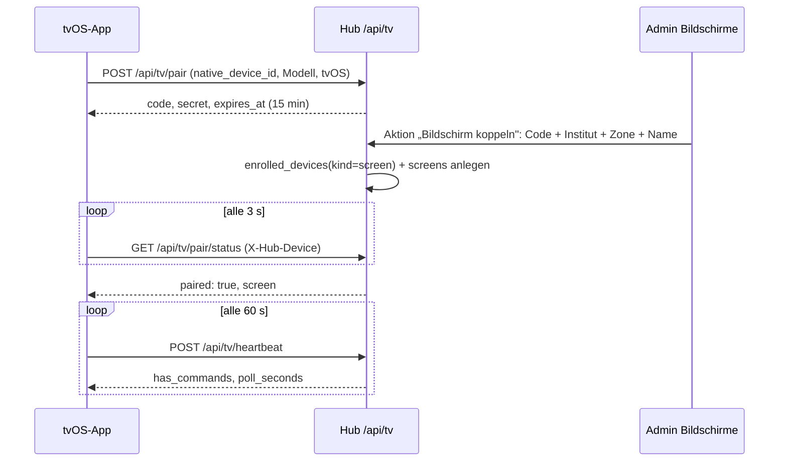

# Bildschirme (Apple-TV-App „glattt Screens")

Digital-Signage-Player für die Institute (Bewertungen, Promo-Playlists mit Zeitplan) und Berichts-
bildschirm für die Zentrale, als native tvOS-App. **Stand 24.09.2026: Phase 1 (Backend-Kern) auf
`develop`** — Kopplung per Code, Gerätenachweis, Heartbeat, Steuerkanal, Admin-Resource „Bildschirme",
Aufräum-Cron. Inhalte (Medien, Testimonials, Playlists, Zeitpläne, Manifest) folgen in Phase 2, die
tvOS-App in Phase 3. Vollständiger Bauplan mit Entscheidungen und Arbeitspaketen als Claude-Doc:
[Apple-TV-App: Bauplan](https://claude.ai/code/artifact/3bdd5ce6-0a39-413b-874a-d4d91e4cbeb8);
Projektwissen `.github/knowledge/tvos-app-bauplan.md`.

---

## Für Endanwender

!!! nutzerhandbuch "Bedienung: Serie „Bildschirme" — Klickanleitung entsteht mit Phase 5"
    Ein Apple TV zeigt beim ersten Start einen sechsstelligen Code. Im Admin-Backend unter
    **Betrieb → Bildschirme → Bildschirm koppeln** wird der Code eingetragen und der Bildschirm einem
    Institut, einer Zone (Schaufenster, Empfang, Kabine, Büro) und einer Ausrichtung zugeordnet. Danach
    läuft der Fernseher ohne Anmeldung. Die Liste zeigt je Bildschirm, ob er online ist und was gerade
    läuft; über das Menü lassen sich „Neu laden", „Neustart" und „Cache leeren" senden, ein Bildschirm
    deaktivieren oder trennen.

---

## Für Entwickler

### Architektur

Der TV ist ein dünner Player: Er kennt nur sein Gerätegeheimnis, holt vom Hub ein Manifest (Phase 2)
und meldet sich alle 60 s per Heartbeat. Alle Logik (Zeitplan, Rechte, Sichtbarkeit) liegt im Hub.
tvOS hat kein WebKit — die App ist vollständig nativ (SwiftUI + AVFoundation) und teilt Code mit
der [iOS-App](IOS-APP.md) über `ios/Shared`.

Die Kopplung baut auf dem [Gerätevertrauen](APP-GERAETE-FREISCHALTUNG.md) auf: Nach der Zuordnung
existiert ein `enrolled_devices`-Eintrag mit `kind = screen`; die TVs erscheinen damit auch in der
Hub-Seite „App-Geräte". Bis zur Zuordnung gilt das Geheimnis nur für die Statusabfrage der Kopplung.

### Datenmodell (Phase 1)

| Tabelle | Zweck | Wichtige Spalten |
|---|---|---|
| `screens` | Gekoppelter Apple TV | `name`, `branch_id`, `zone` (shop_window/reception/cabin/office/other), `orientation` (landscape/portrait), `mode` (signage/kpi), `enrolled_device_id`, `user_id` (KPI-Modus, Phase 4), `settings` JSON, `app_version`, `os_version`, `last_seen_at`, `last_manifest_etag`, `current_item` JSON, `cache_bytes`, `paired_by`, `paired_at`, `disabled_at`, SoftDeletes |
| `screen_pairing_codes` | Offener Kopplungscode | `code` (6 Zeichen aus `ABCDEFGHJKLMNPQRSTUVWXYZ23456789`), `native_device_id`, `device_secret_hash` (SHA-256), Gerätedaten, `expires_at`, `claimed_screen_id`, `claimed_at` |
| `screen_commands` | Steuerkanal | `screen_id`, `type` (refresh/restart/clear_cache, später Beratungsmodus), `payload` JSON, `issued_by`, `expires_at`, `consumed_at` |

Migrationen `2026_09_24_000100_create_screens_tables` und `2026_09_24_000200_add_manage_screens_permission`.
Phase 2 ergänzt `screen_media`, `testimonials`, `screen_playlists`, `screen_playlist_items`,
`screen_schedules` sowie Felder am Institut (`google_rating*`, `opening_hours`).

### Services und Middleware

- `App\Services\Screens\ScreenPairingService` — `begin()` (Code + Geheimnis, frühere offene Codes des
  Geräts verfallen), `findClaimable()`/`claim()` (Gerät freischalten oder erneuern, Bildschirm anlegen
  bzw. wiederherstellen), `pendingForSecret()`/`screenForSecret()`, `heartbeat()`, `disable()`/`enable()`,
  `disconnect()` (Gerät widerrufen, Bildschirm soft-löschen). Fehler als `ScreenPairingException`
  mit `reason` (`unknown_code`, `expired`, `already_claimed`).
- `App\Services\Screens\ScreenCommandService` — `issue()` (gleichartiger offener Befehl wird nicht
  doppelt angelegt), `pending()`, `hasPending()`, `acknowledge()`.
- `App\Http\Middleware\RequireScreenDevice` (Alias `screen.device`) — Header `X-Hub-Device` muss zu
  einem aktiven Gerät der Art `screen` mit Bildschirm gehören: sonst **401 `unknown_device`** (die App
  startet eine neue Kopplung), deaktivierter Bildschirm **410 `disabled`**. Legt `screen` als
  Request-Attribut ab und zieht „zuletzt gesehen" nach.
- `App\Support\NativeApp` kennt den User-Agent `glatttHub-tvOS/<version>` (`PLATFORM_TVOS`,
  `tvosVersion()`); `config/native_app.php` hat einen `tvos`-Block (`TVOS_APP_MIN_VERSION` …).

### Endpunkte (`routes/tv.php`, Prefix `/api/tv`, IAP-frei, ohne Sitzung)

| Endpunkt | Auth | Zweck |
|---|---|---|
| `GET /api/tv/version` | keine | Versionsregel (`AppVersionPolicy`, Plattform `tvos`) |
| `POST /api/tv/pair` | keine, `throttle:tv-pair` (5/min je IP, 3/min je Gerät) | Kopplungscode + Geheimnis ausstellen (201) |
| `GET /api/tv/pair/status` | Geheimnis, `throttle:tv-device` | `paired: false` + Code, `paired: true` + Bildschirm, 410 `expired`, 401 `unknown_device` |
| `POST /api/tv/heartbeat` | `screen.device` | `app_version`, `os_version`, `current_item`, `cache_bytes` → `has_commands`, `manifest_etag`, `poll_seconds` |
| `GET /api/tv/commands` | `screen.device` | Offene Befehle |
| `POST /api/tv/commands/{id}/ack` | `screen.device` | Befehl bestätigen (404 bei fremdem Befehl) |

Rate-Limiter `tv-pair` und `tv-device` stehen im `AppServiceProvider`. Das Manifest
(`GET /api/tv/manifest`) kommt in Phase 2.

### Admin-Backend

`App\Filament\Resources\Screens\ScreenResource` (Gruppe **Betrieb**, Sort 60, Recht `manage_screens`):
Liste mit Institut, Zone, Modus/Ausrichtung, Status-Badge (online = Heartbeat jünger als 3 min),
„Läuft gerade", Version; Kopf-Aktion **Bildschirm koppeln** (Code, Name, Institut, Zone, Ausrichtung,
Modus — Fehler erscheinen am Code-Feld); Zeilen-Menü mit Neu laden, Neustart, Cache leeren,
Deaktivieren/Aktivieren, Trennen. Kein „Anlegen" — Bildschirme entstehen nur über die Kopplung.
Die Institut-Auswahl zeigt bewusst **alle** Institute inklusive der ausgeblendeten: Ein Bildschirm
hängt in einem konkreten Institut, auch wenn es noch nicht in den Übersichten zählt.

### Rechte

`manage_screens` (Katalog `PermissionCatalog::ENTRIES`, Zweig Institute → Bildschirme, Stufe `full`),
per Migration angelegt und wie `manage_institute_access_tokens` zugeordnet (Büro/Admin).

### Cron

`screens:cleanup` (täglich 03:30, Endpoint `/api/cron/cleanup-screens`, `CronSchedule`): löscht
unbeanspruchte Codes eine Stunde nach Ablauf, zugeordnete Codes nach 7 Tagen, erledigte oder
abgelaufene Befehle nach 7 Tagen. **Der Cloud-Scheduler-Job muss noch angelegt werden**
(`--max-retry-attempts=3`, siehe [Cloud Scheduler](CLOUD-SCHEDULER-SETUP.md)); `cron:audit` meldet
ihn bis dahin.

### Fallstricke

- Das Kopplungscode-Alphabet hat weder `0/O` noch `1/I`; `normalizeCode()` lehnt solche Eingaben ab,
  statt sie zu raten — der Code auf dem Fernseher ist immer eindeutig lesbar.
- `disconnect()` löscht den Bildschirm nur weich. Koppelt dasselbe Gerät erneut (gleiche
  `native_device_id`), wird der Bildschirm wiederhergestellt und bekommt die neuen Angaben; das alte
  Geheimnis bleibt ungültig.
- `deviceRevoked()` des Benachrichtigungs-Katalogs feuert auch beim Trennen eines Bildschirms (Modul
  App-Geräte) — gewollt, damit das Büro es sieht.

### Tests

`tests/Feature/ScreenPairingTest.php` (Kopplung, Status, Heartbeat, Befehle, 410/401, erneute Kopplung,
Ablauf + Aufräumen, Version, Admin-Recht), `tests/Unit/ScreenPairingCodeTest.php` (Alphabet,
Normalisierung). Konventionstests: `CronScheduleCoverageTest`, `PermissionCatalogTest`,
`AdminNavigationGroupTest`, `EnvExampleConventionTest`.

## Changelog

- **24.09.2026** — Phase 1 (Backend-Kern) auf `develop`: Kopplung, Gerätenachweis, Heartbeat, Steuerkanal, Admin-Resource, Cron.
