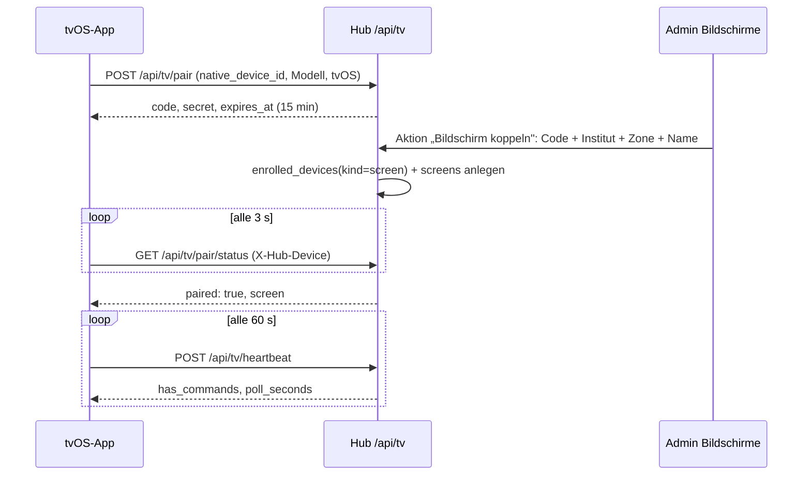

# Bildschirme (Apple-TV-App „glattt Screens")

Digital-Signage-Player für die Institute (Bewertungen, Promo-Playlists mit Zeitplan) und Berichts-
bildschirm für die Zentrale, als native tvOS-App. **Stand 24.09.2026: Phase 1 (Backend-Kern) und
Phase 2 (Inhalte) auf `develop`** — Kopplung per Code, Gerätenachweis, Heartbeat, Steuerkanal, Mediathek
mit Direkt-Upload, Testimonials, Playlists mit Browser-Vorschau, Zeitpläne mit „Jetzt zeigen", Manifest
mit ETag, Google-Gesamtwertung und Öffnungszeiten je Institut. Die tvOS-App folgt in Phase 3. Vollständiger Bauplan mit Entscheidungen und Arbeitspaketen als Claude-Doc:
[Apple-TV-App: Bauplan](https://claude.ai/code/artifact/3bdd5ce6-0a39-413b-874a-d4d91e4cbeb8);
Projektwissen `.github/knowledge/tvos-app-bauplan.md`.

---

## Für Endanwender

!!! nutzerhandbuch "Bedienung: Serie „Bildschirme" — Klickanleitung entsteht mit Phase 5"
    Ein Apple TV zeigt beim ersten Start einen sechsstelligen Code. Im Admin-Backend unter
    **Betrieb → Bildschirme → Bildschirm koppeln** wird der Code eingetragen und der Bildschirm einem
    Institut, einer Zone (Schaufenster, Empfang, Kabine, Büro) und einer Ausrichtung zugeordnet. Danach
    läuft der Fernseher ohne Anmeldung. Die Liste zeigt je Bildschirm, ob er online ist und was gerade
    läuft; über das Menü lassen sich „Neu laden", „Neustart" und „Cache leeren" senden, ein Bildschirm
    deaktivieren oder trennen.

    Was läuft, kommt aus vier Bausteinen unter **Betrieb**: **Medien** (Bilder und Videos bis 1 GB,
    hochgeladen über „Medien hochladen"), **Testimonials** (Kundenstimmen, frei erfasst oder aus einer
    Google-Bewertung des Bonus-Boards übernommen; nur freigegebene erscheinen), **Playlists** (Reihenfolge
    aus Bild, Video, Bewertungen, Gesamtwertung, QR-Code — mit Vorschau im Browser) und **Zeitpläne**
    (welche Playlist wann auf welchen Bildschirmen; „Jetzt zeigen" schaltet eine Playlist sofort für
    1 bis 168 Stunden). Ohne passenden Zeitplan läuft die Standard-Playlist des Bildschirms, sonst die
    globale Standard-Playlist, sonst der Standby-Bildschirm mit Logo, Öffnungszeiten und Buchungs-QR.
    Die Google-Gesamtwertung (Schnitt, Anzahl, Stand) und die Öffnungszeiten pflegt das Büro im
    Institut-Modul im Reiter „Infos"; nach 60 Tagen erinnert der Hub an die Gesamtwertung.

---

## Für Entwickler

### Architektur

Der TV ist ein dünner Player: Er kennt nur sein Gerätegeheimnis, holt vom Hub ein Manifest (Phase 2)
und meldet sich alle 60 s per Heartbeat. Alle Logik (Zeitplan, Rechte, Sichtbarkeit) liegt im Hub.
tvOS hat kein WebKit — die App ist vollständig nativ (SwiftUI + AVFoundation) und teilt Code mit
der [iOS-App](IOS-APP.md) über `ios/Shared`.

Die Kopplung baut auf dem [Gerätevertrauen](APP-GERAETE-FREISCHALTUNG.md) auf: Nach der Zuordnung
existiert ein `enrolled_devices`-Eintrag mit `kind = screen`; die TVs erscheinen damit auch in der
Hub-Seite „App-Geräte". Bis zur Zuordnung gilt das Geheimnis nur für die Statusabfrage der Kopplung.

### Datenmodell (Phase 1)

| Tabelle | Zweck | Wichtige Spalten |
|---|---|---|
| `screens` | Gekoppelter Apple TV | `name`, `branch_id`, `zone` (shop_window/reception/cabin/office/other), `orientation` (landscape/portrait), `mode` (signage/kpi), `enrolled_device_id`, `user_id` (KPI-Modus, Phase 4), `settings` JSON, `app_version`, `os_version`, `last_seen_at`, `last_manifest_etag`, `current_item` JSON, `cache_bytes`, `paired_by`, `paired_at`, `disabled_at`, SoftDeletes |
| `screen_pairing_codes` | Offener Kopplungscode | `code` (6 Zeichen aus `ABCDEFGHJKLMNPQRSTUVWXYZ23456789`), `native_device_id`, `device_secret_hash` (SHA-256), Gerätedaten, `expires_at`, `claimed_screen_id`, `claimed_at` |
| `screen_commands` | Steuerkanal | `screen_id`, `type` (refresh/restart/clear_cache, später Beratungsmodus), `payload` JSON, `issued_by`, `expires_at`, `consumed_at` |

Migrationen `2026_09_24_000100_create_screens_tables` und `2026_09_24_000200_add_manage_screens_permission`.

### Datenmodell (Phase 2)

| Tabelle | Zweck | Wichtige Spalten |
|---|---|---|
| `screen_media` | Bild/Video der Mediathek | `kind`, `title`, `disk`, `path` (Original), `tv_path` (TV-Fassung), `poster_path`, `mime_type`, `file_size`, `width`, `height`, `duration_seconds`, `orientation`, `checksum_sha256`, `status` (uploading/processing/ready/failed), `error`, `portrait_media_id` (Hochkant-Variante), `tags`, `uploaded_by`, SoftDeletes |
| `testimonials` | Kundenstimme | `author_name`, `author_location`, `stars`, `text` (≤ 280), `photo_path`, `branch_ids` JSON (null = alle), `source` (manual/google), `google_review_id`, `approved`, `consent_given_at`, `valid_from`, `valid_until`, `sort_order` |
| `screen_playlists` | Abfolge | `name`, `description`, `shuffle`, `transition`, `testimonial_seconds`, `is_default` (höchstens eine) |
| `screen_playlist_items` | Element | `playlist_id`, `position`, `type` (image/video/testimonials/rating/qr), `media_id`, `duration_seconds`, `with_sound`, `fit`, `qr_url`, `caption`, `enabled` |
| `screen_schedules` | Zeitplan | `playlist_id`, `branch_ids`/`zones`/`screen_ids` JSON (null = alle), `weekdays` JSON (ISO 1–7), `start_time`/`end_time` (über Mitternacht erlaubt), `valid_from`/`valid_until` (datetime), `priority` (100 = „Jetzt zeigen"), `active` |
| `screens` | + `default_playlist_id` | Standard-Playlist des Bildschirms |
| `institute_contacts` | + `google_rating`, `google_rating_count`, `google_rating_as_of`, `opening_hours` JSON | Gesamtwertung und Öffnungszeiten je Institut (Standby, Element „Gesamtwertung") |

Migration `2026_09_24_010000_create_screen_content_tables`.

### Services und Middleware

- `App\Services\Screens\ScreenPairingService` — `begin()` (Code + Geheimnis, frühere offene Codes des
  Geräts verfallen), `findClaimable()`/`claim()` (Gerät freischalten oder erneuern, Bildschirm anlegen
  bzw. wiederherstellen), `pendingForSecret()`/`screenForSecret()`, `heartbeat()`, `disable()`/`enable()`,
  `disconnect()` (Gerät widerrufen, Bildschirm soft-löschen). Fehler als `ScreenPairingException`
  mit `reason` (`unknown_code`, `expired`, `already_claimed`).
- `App\Services\Screens\ScreenCommandService` — `issue()` (gleichartiger offener Befehl wird nicht
  doppelt angelegt), `pending()`, `hasPending()`, `acknowledge()`.
- `App\Http\Middleware\RequireScreenDevice` (Alias `screen.device`) — Header `X-Hub-Device` muss zu
  einem aktiven Gerät der Art `screen` mit Bildschirm gehören: sonst **401 `unknown_device`** (die App
  startet eine neue Kopplung), deaktivierter Bildschirm **410 `disabled`**. Legt `screen` als
  Request-Attribut ab und zieht „zuletzt gesehen" nach.
- `App\Support\NativeApp` kennt den User-Agent `glatttHub-tvOS/<version>` (`PLATFORM_TVOS`,
  `tvosVersion()`); `config/native_app.php` hat einen `tvos`-Block (`TVOS_APP_MIN_VERSION` …).

### Endpunkte (`routes/tv.php`, Prefix `/api/tv`, IAP-frei, ohne Sitzung)

| Endpunkt | Auth | Zweck |
|---|---|---|
| `GET /api/tv/version` | keine | Versionsregel (`AppVersionPolicy`, Plattform `tvos`) |
| `POST /api/tv/pair` | keine, `throttle:tv-pair` (5/min je IP, 3/min je Gerät) | Kopplungscode + Geheimnis ausstellen (201) |
| `GET /api/tv/pair/status` | Geheimnis, `throttle:tv-device` | `paired: false` + Code, `paired: true` + Bildschirm, 410 `expired`, 401 `unknown_device` |
| `POST /api/tv/heartbeat` | `screen.device` | `app_version`, `os_version`, `current_item`, `cache_bytes` → `has_commands`, `manifest_etag`, `poll_seconds` |
| `GET /api/tv/commands` | `screen.device` | Offene Befehle |
| `POST /api/tv/commands/{id}/ack` | `screen.device` | Befehl bestätigen (404 bei fremdem Befehl) |

Rate-Limiter `tv-pair` und `tv-device` stehen im `AppServiceProvider`.

### Manifest (`GET /api/tv/manifest`, `screen.device`)

`ScreenManifestService::build()` liefert Bildschirm-Stammdaten, `program` (Abschnitte der nächsten 24 h
mit `playlist_id`/`schedule_id`), die referenzierten `playlists` (nur spielbare Elemente: aktiv, Medium
bereit), `media` (signierte URLs 24 h, `sha256`, Masse, Dauer; auf Hochkant-Bildschirmen die
Hochkant-Variante), `testimonials` (freigegeben, im Zeitraum, passend zum Standort, höchstens 40),
`rating` (Gesamtwertung des Instituts), `standby` (Kopfzeile, Öffnungszeiten je ISO-Wochentag,
Buchungs-URL `glattt.com/standorte/<stadt>/#termin`) und `poll_seconds`. Der **ETag** rechnet ohne
signierte URLs und Zeitstempel; `If-None-Match` mit dem letzten ETag → **304**. Der TV cached Medien nach
`media_id + sha256`, nie nach URL. Lokal (Disk `public`) sind die URLs die öffentlichen `/storage/…`-Pfade.

### Zeitplan-Auflösung (`ScreenScheduleResolver`)

Kandidaten: aktive Pläne, die den Bildschirm treffen (`targets()`: Bildschirm, Zone, Standort oder alle)
und im Moment wirksam sind (`coversMoment()`: Gültigkeit, Wochentag, Tagesfenster — Ende vor Beginn =
über Mitternacht). Reihenfolge: `priority` absteigend, dann Spezifität (Bildschirm 4 > Zone 2 > Standort 1),
dann kürzeres Tagesfenster, dann neuere ID. Kein Treffer: `screens.default_playlist_id`, sonst Playlist mit
`is_default`, sonst Standby. `program()` sammelt alle Umschaltpunkte (Gültigkeitskanten **sekundengenau**,
Fensterkanten je Tag, Mitternacht bei Wochentagsplänen) und fasst gleiche Nachbarn zusammen. Die Seite
**Bildschirme → Programm heute** zeigt dieselbe Auflösung je Bildschirm.

### Mediathek und Direkt-Upload

`ScreenMediaUploadService::begin()` legt das Medium mit `status=uploading` an und liefert dem Browser das
Ziel: in der Cloud eine **signierte PUT-URL (V4, 60 min, Content-Type fixiert)** des privaten Buckets
(`gcs-private`, Pfad `screens/media/<uuid>/original.<ext>`), lokal ein Hub-Endpunkt bis 20 MB. Der Upload
läuft im Browser (`XMLHttpRequest`, Fortschritt), `complete()` prüft das Objekt und stösst
`ProcessScreenMedia` auf dem Worker an: ffprobe/ffmpeg (H.264 High, längste Kante 1920 px, CRF 21,
8 Mbit/s, AAC, faststart; Rotation aus den Metadaten), Poster bei Sekunde 1, Bilder per GD auf 3840 px
mit EXIF-Drehung, SHA-256 der TV-Fassung, Ausrichtung aus den Massen. Ohne ffmpeg (lokal) bleibt das
Original die TV-Fassung; HEIC braucht Imagick, sonst „bitte als JPEG exportieren". Endpunkte unter
`/admin-screens/media/*` (`begin`, `{id}/upload`, `{id}/complete`, `{id}/status`), Recht `manage_screens`.
Der Bucket `glattthub` hat seit 24.09.2026 eine CORS-Regel für `hub.glattt.com` und
`staging.hub.glattt.com` (PUT/GET/HEAD, `Content-Type`), siehe [Cloud Storage](CLOUD-STORAGE-SETUP.md).

### Admin-Resources (Phase 2)

- **Medien** (`ScreenMediaResource`, Sort 61): Liste mit Poster, Stand, Verwendung; Seite „Medien hochladen"
  (Alpine, kein Livewire-Upload); Bearbeiten: Titel, Hochkant-Variante, Schlagworte; Löschen nur ohne Verwendung.
- **Testimonials** (`TestimonialResource`, Sort 62): Formular mit Einwilligungs-Regel (Pflichtdatum bei
  vollem Nachnamen — `Testimonial::hasFullSurname()` — oder Foto), Kopf-Aktion „Aus Google-Bewertung
  übernehmen" (nur Bewertungen mit Text, noch nicht übernommen; Eintrag entsteht ohne Freigabe).
- **Playlists** (`ScreenPlaylistResource`, Sort 63): Repeater der Elemente (`orderColumn('position')`),
  Standard-Playlist-Schalter (`makeDefault()` hält es bei einer), Seite **Vorschau** (`/vorschau`, Standort
  und Ausrichtung wählbar; dieselbe Ablauflogik wie der TV, QR über einen öffentlichen Renderer nur in der
  Vorschau — der TV zeichnet QR-Codes selbst).
- **Zeitpläne** (`ScreenScheduleResource`, Sort 64): Wo (Standorte, Zonen, Bildschirme), Wann (Wochentage,
  Von/Bis, Gültig ab/bis), Priorität; Kopf-Aktion **Jetzt zeigen** (Playlist, Ziel, 1/4/24/168 h →
  Zeitplan mit Priorität 100, endet von selbst).

### Institut-Modul

Reiter „Infos" → Kontaktkanäle: **Google-Bewertung** (Schnitt mit Komma, Anzahl, Stand per flatpickr) und
**Öffnungszeiten** je Wochentag (HH:MM, leer = geschlossen; nicht gesendete Tage bleiben Standard
Mo–Fr 07–21, Sa 09:30–18). Gespeichert über `POST /phorest/institute/{branchId}/contact` (Recht
`manage_branch_images`). Benachrichtigungs-Anlass `screens.rating_stale` (Modul Betrieb, Zielgruppe
`manage_branch_images`), ausgelöst vom täglichen `screens:cleanup` für Institute mit aktivem Bildschirm,
deren Stand älter als 60 Tage ist oder fehlt — einmal je Institut und Monat.

### Admin-Backend

`App\Filament\Resources\Screens\ScreenResource` (Gruppe **Betrieb**, Sort 60, Recht `manage_screens`):
Liste mit Institut, Zone, Modus/Ausrichtung, Status-Badge (online = Heartbeat jünger als 3 min),
„Läuft gerade", Version; Kopf-Aktion **Bildschirm koppeln** (Code, Name, Institut, Zone, Ausrichtung,
Modus — Fehler erscheinen am Code-Feld); Zeilen-Menü mit Neu laden, Neustart, Cache leeren,
Deaktivieren/Aktivieren, Trennen. Kein „Anlegen" — Bildschirme entstehen nur über die Kopplung.
Die Institut-Auswahl zeigt bewusst **alle** Institute inklusive der ausgeblendeten: Ein Bildschirm
hängt in einem konkreten Institut, auch wenn es noch nicht in den Übersichten zählt.

### Rechte

`manage_screens` (Katalog `PermissionCatalog::ENTRIES`, Zweig Institute → Bildschirme, Stufe `full`),
per Migration angelegt und wie `manage_institute_access_tokens` zugeordnet (Büro/Admin).

### Cron

`screens:cleanup` (täglich 03:30, Endpoint `/api/cron/cleanup-screens`, `CronSchedule`): löscht
unbeanspruchte Codes eine Stunde nach Ablauf, zugeordnete Codes nach 7 Tagen, erledigte oder
abgelaufene Befehle nach 7 Tagen. Cloud-Scheduler-Job `cleanup-screens` (Prod, `30 3 * * *`,
drei Wiederholungen) am 24.09.2026 angelegt, siehe [Cloud Scheduler](CLOUD-SCHEDULER-SETUP.md).

### Fallstricke

- Gültigkeitskanten im `program()` **nie auf die Minute runden**: `valid_until` 23:44:14 gerundet auf
  23:44:00 liegt noch im Plan, der Abschnitt danach fällt weg (Befund 24.09.2026, Test
  `jetzt_zeigen_schlaegt_den_regulaeren_plan`).
- Der signierte Upload braucht den **exakten Content-Type** der Signatur; der Browser sendet `file.type`
  — MOV-Dateien melden `video/quicktime`, das steht in `ScreenMedia::ACCEPTED_MIME`.
- Öffnungszeiten: ein Tag, der im Request fehlt, ist Standard; ein gesendeter Tag ohne beide Zeiten ist
  geschlossen — sonst würde ein Teil-Request alle anderen Tage schliessen.

- Das Kopplungscode-Alphabet hat weder `0/O` noch `1/I`; `normalizeCode()` lehnt solche Eingaben ab,
  statt sie zu raten — der Code auf dem Fernseher ist immer eindeutig lesbar.
- `disconnect()` löscht den Bildschirm nur weich. Koppelt dasselbe Gerät erneut (gleiche
  `native_device_id`), wird der Bildschirm wiederhergestellt und bekommt die neuen Angaben; das alte
  Geheimnis bleibt ungültig.
- `deviceRevoked()` des Benachrichtigungs-Katalogs feuert auch beim Trennen eines Bildschirms (Modul
  App-Geräte) — gewollt, damit das Büro es sieht.

### Tests

`tests/Feature/ScreenPairingTest.php` (Kopplung, Status, Heartbeat, Befehle, 410/401, erneute Kopplung,
Ablauf + Aufräumen, Version, Admin-Recht), `tests/Unit/ScreenPairingCodeTest.php` (Alphabet,
Normalisierung), `tests/Unit/ScreenScheduleResolverTest.php` (Fallbacks, Priorität/Spezifität, Fenster
über Mitternacht, Wochentage, Programm-Abschnitte), `tests/Feature/ScreenContentTest.php` (Manifest mit
ETag, Hochkant-Variante, Jetzt zeigen, Direkt-Upload lokal + Bildverarbeitung, Testimonial-Regeln,
Institut-Felder, veraltete Wertung, Admin-Seiten). Konventionstests: `CronScheduleCoverageTest`, `PermissionCatalogTest`,
`AdminNavigationGroupTest`, `EnvExampleConventionTest`.

## Changelog

- **24.09.2026** — Phase 2 (Inhalte) auf `develop`: Mediathek mit Direkt-Upload und Verarbeitung, Testimonials mit Google-Übernahme, Playlists mit Vorschau, Zeitpläne mit „Jetzt zeigen", Manifest mit ETag, Gesamtwertung und Öffnungszeiten im Institut.
- **24.09.2026** — Phase 1 (Backend-Kern) auf `develop`: Kopplung, Gerätenachweis, Heartbeat, Steuerkanal, Admin-Resource, Cron.
