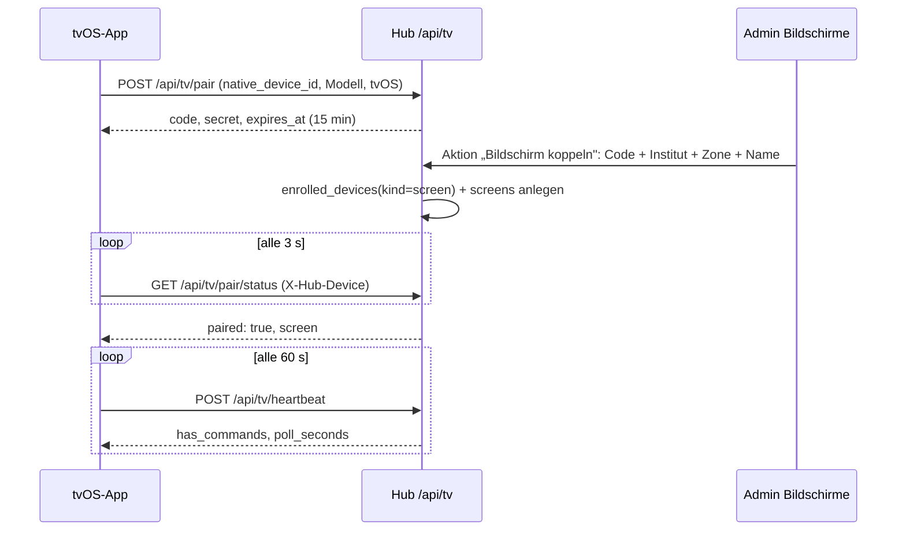

# Bildschirme (Apple-TV-App „glattt Screens")

Digital-Signage-Player für die Institute (Bewertungen, Promo-Playlists mit Zeitplan) und Berichts-
bildschirm für die Zentrale, als native tvOS-App. **Stand 24.09.2026: Phase 1 (Backend-Kern) und
Phase 2 (Inhalte) auf `develop`** — Kopplung per Code, Gerätenachweis, Heartbeat, Steuerkanal, Mediathek
mit Direkt-Upload, Testimonials, Playlists mit Browser-Vorschau, Zeitpläne mit „Jetzt zeigen", Manifest
mit ETag, Google-Gesamtwertung und Öffnungszeiten je Institut. **Phase 3 (tvOS-App v1) ebenfalls auf
`develop`:** Target `glatttHubTV` im iOS-Projekt, Kopplung, Manifest-Wiedergabe (Bild, Video, Testimonials,
Gesamtwertung, QR, Standby), Cache, Hochkant, Marken-Design — am 23.09.2026 im Simulator gegen den
lokalen Hub durchgespielt (Kopplung → Zuordnung → Programm). Vollständiger Bauplan mit Entscheidungen und Arbeitspaketen als Claude-Doc:
[Apple-TV-App: Bauplan](https://claude.ai/code/artifact/3bdd5ce6-0a39-413b-874a-d4d91e4cbeb8);
Projektwissen `.github/knowledge/tvos-app-bauplan.md`.

---

## Für Endanwender

!!! nutzerhandbuch "Bedienung: Serie „Bildschirme" — Klickanleitung entsteht mit Phase 5"
    Ein Apple TV zeigt beim ersten Start einen sechsstelligen Code. Im Admin-Backend unter
    **Betrieb → Bildschirme → Bildschirm koppeln** wird der Code eingetragen und der Bildschirm einem
    Institut, einer Zone (Schaufenster, Empfang, Kabine, Büro) und einer Ausrichtung zugeordnet. Danach
    läuft der Fernseher ohne Anmeldung. Die Liste zeigt je Bildschirm, ob er online ist und was gerade
    läuft; über das Menü lassen sich „Neu laden", „Neustart" und „Cache leeren" senden, ein Bildschirm
    deaktivieren oder trennen.

    Was läuft, kommt aus vier Bausteinen unter **Betrieb**: **Medien** (Bilder und Videos bis 1 GB,
    hochgeladen über „Medien hochladen"), **Testimonials** (Kundenstimmen, frei erfasst oder aus einer
    Google-Bewertung des Bonus-Boards übernommen; nur freigegebene erscheinen), **Playlists** (Reihenfolge
    aus Bild, Video, Bewertungen, Gesamtwertung, QR-Code — mit Vorschau im Browser) und **Zeitpläne**
    (welche Playlist wann auf welchen Bildschirmen; „Jetzt zeigen" schaltet eine Playlist sofort für
    1 bis 168 Stunden). Ohne passenden Zeitplan läuft die Standard-Playlist des Bildschirms, sonst die
    globale Standard-Playlist, sonst der Standby-Bildschirm mit Logo, Öffnungszeiten und Buchungs-QR.
    Die Google-Gesamtwertung (Schnitt, Anzahl, Stand) und die Öffnungszeiten pflegt das Büro im
    Institut-Modul im Reiter „Infos"; nach 60 Tagen erinnert der Hub an die Gesamtwertung.

    **Kennzahlen-Modus (Zentrale):** Ein Bildschirm im Modus „Kennzahlen" blättert durch Eigene
    Dashboards — im Formular des Bildschirms werden die Seiten (Dashboard, Zeitraum, Sekunden je Seite)
    zusammengestellt. Kennzahlen erscheinen als Kacheln mit Tendenz und Verlauf, Statistik-Karten als
    Bild, so wie sie im Hub aussehen; die Bilder erneuert der Hub alle 15 Minuten („Karten jetzt
    rendern" stößt es sofort an). Gerechnet wird mit den Rechten des Bildschirm-Nutzers — ohne
    Zuordnung mit dem technischen Nutzer „Bildschirm Zentrale", der alle Berichte lesen darf.

---

## Für Entwickler

### Architektur

Der TV ist ein dünner Player: Er kennt nur sein Gerätegeheimnis, holt vom Hub ein Manifest (Phase 2)
und meldet sich alle 60 s per Heartbeat. Alle Logik (Zeitplan, Rechte, Sichtbarkeit) liegt im Hub.
tvOS hat kein WebKit — die App ist vollständig nativ (SwiftUI + AVFoundation) und teilt Code mit
der [iOS-App](IOS-APP.md) über `ios/Shared`.

Die Kopplung baut auf dem [Gerätevertrauen](APP-GERAETE-FREISCHALTUNG.md) auf: Nach der Zuordnung
existiert ein `enrolled_devices`-Eintrag mit `kind = screen`; die TVs erscheinen damit auch in der
Hub-Seite „App-Geräte". Bis zur Zuordnung gilt das Geheimnis nur für die Statusabfrage der Kopplung.

### Datenmodell (Phase 1)

| Tabelle | Zweck | Wichtige Spalten |
|---|---|---|
| `screens` | Gekoppelter Apple TV | `name`, `branch_id`, `zone` (shop_window/reception/cabin/office/other), `orientation` (landscape/portrait), `mode` (signage/kpi), `enrolled_device_id`, `user_id` (KPI-Modus, Phase 4), `settings` JSON, `app_version`, `os_version`, `last_seen_at`, `last_manifest_etag`, `current_item` JSON, `cache_bytes`, `paired_by`, `paired_at`, `disabled_at`, SoftDeletes |
| `screen_pairing_codes` | Offener Kopplungscode | `code` (6 Zeichen aus `ABCDEFGHJKLMNPQRSTUVWXYZ23456789`), `native_device_id`, `device_secret_hash` (SHA-256), Gerätedaten, `expires_at`, `claimed_screen_id`, `claimed_at` |
| `screen_commands` | Steuerkanal | `screen_id`, `type` (refresh/restart/clear_cache, später Beratungsmodus), `payload` JSON, `issued_by`, `expires_at`, `consumed_at` |

Migrationen `2026_09_24_000100_create_screens_tables` und `2026_09_24_000200_add_manage_screens_permission`.

### Datenmodell (Phase 2)

| Tabelle | Zweck | Wichtige Spalten |
|---|---|---|
| `screen_media` | Bild/Video der Mediathek | `kind`, `title`, `disk`, `path` (Original), `tv_path` (TV-Fassung), `poster_path`, `mime_type`, `file_size`, `width`, `height`, `duration_seconds`, `orientation`, `checksum_sha256`, `status` (uploading/processing/ready/failed), `error`, `portrait_media_id` (Hochkant-Variante), `tags`, `uploaded_by`, SoftDeletes |
| `testimonials` | Kundenstimme | `author_name`, `author_location`, `stars`, `text` (≤ 280), `photo_path`, `branch_ids` JSON (null = alle), `source` (manual/google), `google_review_id`, `approved`, `consent_given_at`, `valid_from`, `valid_until`, `sort_order` |
| `screen_playlists` | Abfolge | `name`, `description`, `shuffle`, `transition`, `testimonial_seconds`, `is_default` (höchstens eine) |
| `screen_playlist_items` | Element | `playlist_id`, `position`, `type` (image/video/testimonials/rating/qr), `media_id`, `duration_seconds`, `with_sound`, `fit`, `qr_url`, `caption`, `enabled` |
| `screen_schedules` | Zeitplan | `playlist_id`, `branch_ids`/`zones`/`screen_ids` JSON (null = alle), `weekdays` JSON (ISO 1–7), `start_time`/`end_time` (über Mitternacht erlaubt), `valid_from`/`valid_until` (datetime), `priority` (100 = „Jetzt zeigen"), `active` |
| `screens` | + `default_playlist_id` | Standard-Playlist des Bildschirms |
| `institute_contacts` | + `google_rating`, `google_rating_count`, `google_rating_as_of`, `opening_hours` JSON | Gesamtwertung und Öffnungszeiten je Institut (Standby, Element „Gesamtwertung") |

Migration `2026_09_24_010000_create_screen_content_tables`.

### Datenmodell (Phase 4, Kennzahlen-Modus)

| Tabelle | Zweck | Felder |
|---|---|---|
| `screen_dashboards` | Seiten eines Bildschirms im Kennzahlen-Modus | `screen_id`, `custom_dashboard_id`, `position`, `seconds` (10–600, Standard 30), `range` (`today`/`week`/`month`/`last_28`/`year` = `WidgetKpiService::RANGES`) |
| `screen_dashboard_cards` | Gerenderte Statistik-Karten je Seite | `screen_dashboard_id`, `statistic_key`, `disk`, `path`, `sha256`, `bytes`, `width`, `height`, `rendered_at`, `error` (letzter Render-Fehler); unique je Seite + Statistik |

Dazu `screens.user_id` (Bildschirm-Nutzer, sonst technischer Nutzer `bildschirm-zentrale@system.glattt.com`,
angelegt in derselben Migration mit allen lesenden Berichtsrechten des Katalogs, kein Hub-Zugang) und
`screens.settings.kpi_all_branches` (alle Standorte statt des eigenen; Zone „Büro" zeigt ohnehin alle).
`Screen::kpiUser()` liefert den wirksamen Nutzer, `Screen::dashboards()` die Seiten in Reihenfolge.

### Services und Middleware

- `App\Services\Screens\ScreenPairingService` — `begin()` (Code + Geheimnis, frühere offene Codes des
  Geräts verfallen), `findClaimable()`/`claim()` (Gerät freischalten oder erneuern, Bildschirm anlegen
  bzw. wiederherstellen), `pendingForSecret()`/`screenForSecret()`, `heartbeat()`, `disable()`/`enable()`,
  `disconnect()` (Gerät widerrufen, Bildschirm soft-löschen). Fehler als `ScreenPairingException`
  mit `reason` (`unknown_code`, `expired`, `already_claimed`).
- `App\Services\Screens\ScreenCommandService` — `issue()` (gleichartiger offener Befehl wird nicht
  doppelt angelegt), `pending()`, `hasPending()`, `acknowledge()`.
- `App\Http\Middleware\RequireScreenDevice` (Alias `screen.device`) — Header `X-Hub-Device` muss zu
  einem aktiven Gerät der Art `screen` mit Bildschirm gehören: sonst **401 `unknown_device`** (die App
  startet eine neue Kopplung), deaktivierter Bildschirm **410 `disabled`**. Legt `screen` als
  Request-Attribut ab und zieht „zuletzt gesehen" nach.
- `App\Support\NativeApp` kennt den User-Agent `glatttHub-tvOS/<version>` (`PLATFORM_TVOS`,
  `tvosVersion()`); `config/native_app.php` hat einen `tvos`-Block (`TVOS_APP_MIN_VERSION` …).

### Endpunkte (`routes/tv.php`, Prefix `/api/tv`, IAP-frei, ohne Sitzung)

| Endpunkt | Auth | Zweck |
|---|---|---|
| `GET /api/tv/version` | keine | Versionsregel (`AppVersionPolicy`, Plattform `tvos`) |
| `POST /api/tv/pair` | keine, `throttle:tv-pair` (5/min je IP, 3/min je Gerät) | Kopplungscode + Geheimnis ausstellen (201) |
| `GET /api/tv/pair/status` | Geheimnis, `throttle:tv-device` | `paired: false` + Code, `paired: true` + Bildschirm, 410 `expired`, 401 `unknown_device` |
| `POST /api/tv/heartbeat` | `screen.device` | `app_version`, `os_version`, `current_item`, `cache_bytes` → `has_commands`, `manifest_etag`, `poll_seconds` |
| `GET /api/tv/commands` | `screen.device` | Offene Befehle |
| `POST /api/tv/commands/{id}/ack` | `screen.device` | Befehl bestätigen (404 bei fremdem Befehl) |
| `GET /api/tv/dashboards` | `screen.device` | Kennzahlen-Modus: Seiten mit Werten und Karten-Bildern, ETag/304 wie das Manifest; 409 `not_kpi_mode` für Signage-Bildschirme |

Rate-Limiter `tv-pair` und `tv-device` stehen im `AppServiceProvider`.

### Manifest (`GET /api/tv/manifest`, `screen.device`)

`ScreenManifestService::build()` liefert Bildschirm-Stammdaten, `program` (Abschnitte der nächsten 24 h
mit `playlist_id`/`schedule_id`), die referenzierten `playlists` (nur spielbare Elemente: aktiv, Medium
bereit), `media` (signierte URLs 24 h, `sha256`, Masse, Dauer; auf Hochkant-Bildschirmen die
Hochkant-Variante), `testimonials` (freigegeben, im Zeitraum, passend zum Standort, höchstens 40),
`rating` (Gesamtwertung des Instituts), `standby` (Kopfzeile, Öffnungszeiten je ISO-Wochentag,
Buchungs-URL `glattt.com/standorte/<stadt>/#termin`) und `poll_seconds`. Der **ETag** rechnet ohne
signierte URLs und Zeitstempel; `If-None-Match` mit dem letzten ETag → **304**. Der TV cached Medien nach
`media_id + sha256`, nie nach URL. Lokal (Disk `public`) sind die URLs die öffentlichen `/storage/…`-Pfade.

### Zeitplan-Auflösung (`ScreenScheduleResolver`)

Kandidaten: aktive Pläne, die den Bildschirm treffen (`targets()`: Bildschirm, Zone, Standort oder alle)
und im Moment wirksam sind (`coversMoment()`: Gültigkeit, Wochentag, Tagesfenster — Ende vor Beginn =
über Mitternacht). Reihenfolge: `priority` absteigend, dann Spezifität (Bildschirm 4 > Zone 2 > Standort 1),
dann kürzeres Tagesfenster, dann neuere ID. Kein Treffer: `screens.default_playlist_id`, sonst Playlist mit
`is_default`, sonst Standby. `program()` sammelt alle Umschaltpunkte (Gültigkeitskanten **sekundengenau**,
Fensterkanten je Tag, Mitternacht bei Wochentagsplänen) und fasst gleiche Nachbarn zusammen. Die Seite
**Bildschirme → Programm heute** zeigt dieselbe Auflösung je Bildschirm.

### Mediathek und Direkt-Upload

`ScreenMediaUploadService::begin()` legt das Medium mit `status=uploading` an und liefert dem Browser das
Ziel: in der Cloud eine **signierte PUT-URL (V4, 60 min, Content-Type fixiert)** des privaten Buckets
(`gcs-private`, Pfad `screens/media/<uuid>/original.<ext>`), lokal ein Hub-Endpunkt bis 20 MB. Der Upload
läuft im Browser (`XMLHttpRequest`, Fortschritt), `complete()` prüft das Objekt und stösst
`ProcessScreenMedia` auf dem Worker an: ffprobe/ffmpeg (H.264 High, längste Kante 1920 px, CRF 21,
8 Mbit/s, AAC, faststart; Rotation aus den Metadaten), Poster bei Sekunde 1, Bilder per GD auf 3840 px
mit EXIF-Drehung, SHA-256 der TV-Fassung, Ausrichtung aus den Massen. Ohne ffmpeg (lokal) bleibt das
Original die TV-Fassung; HEIC braucht Imagick, sonst „bitte als JPEG exportieren". Endpunkte unter
`/admin-screens/media/*` (`begin`, `{id}/upload`, `{id}/complete`, `{id}/status`), Recht `manage_screens`.
Der Bucket `glattthub` hat seit 24.09.2026 eine CORS-Regel für `hub.glattt.com` und
`staging.hub.glattt.com` (PUT/GET/HEAD, `Content-Type`), siehe [Cloud Storage](CLOUD-STORAGE-SETUP.md).

### Kennzahlen-Modus (Phase 4)

**Entscheidung (24.09.2026): Weg A des Bauplans** — Statistik-Karten werden als Screenshot der echten
Hub-Karte gerendert, nicht nativ nachgebaut. Damit ist jede Statistik der Registry sofort auf dem
Fernseher, ohne Doppelpflege; der Preis ist Chromium im Docker-Image. Anders als im Bauplan braucht es
**keinen Freigabe-Link** je Dashboard: die Render-Seite läuft über ein Ticket.

Ablauf:

1. `ScreenDashboardService::build(Screen)` baut die Antwort von `GET /api/tv/dashboards`: je Seite
   (`screen_dashboards`) das Dashboard, der Zeitraum (`period()` wie im `WidgetKpiService`), die
   Kennzahlen über `WidgetKpiService::values($user, $kpi_ids, $branch, $range, history: true)` —
   dieselbe Quelle und derselbe 15-Minuten-Cache wie die iOS-Widgets, inklusive Rechteprüfung der
   `KpiRegistry` — und die Karten aus `CustomDashboard::visibleTiles($user)` mit dem Bild-Block
   (`url` signiert 24 h, `sha256`, `bytes`, Maße, `rendered_at`) oder `null`. Standort:
   `branchFor()` = `''` (alle) für Zone „Büro" oder `settings.kpi_all_branches`, sonst der Standort
   des Bildschirms. ETag ohne `generated_at` und ohne URLs. `poll_seconds` 300; der Heartbeat bleibt
   bei 60 s.
2. `RenderScreenDashboardCards` (Job, Queue `default`, `WithoutOverlapping` je Bildschirm) geht über
   alle Seiten: verwaiste Karten (Kachel vom Dashboard entfernt) werden samt Bild gelöscht, Karten älter
   als `screens.render_max_age_minutes` (15) neu gerendert. Auslöser: `screens:render-cards` alle
   15 Minuten (nur Bildschirme mit Heartbeat in den letzten `render_only_seen_minutes`, Option
   `--all`/`--force`), das Speichern des Bildschirm-Formulars und die Aktion „Karten jetzt rendern".
3. `ScreenCardRenderer::render(page, key, filters)`: `ScreenCardTicket::issue()` legt ein 48-Zeichen-
   Ticket (10 min) mit Seite, Statistik und Filtern in den Cache; Node-Skript
   `resources/node/render-screen-card.mjs` (puppeteer-core, System-Chromium aus
   `config('screens.chromium_binary')`) öffnet `/shared/screen-card/{ticket}` über
   `screens.render_base_url` (Standard `APP_URL`), wartet auf `window.__screenCardState() === 'ready'`
   (Alpine-Zustand `loading`/`error` der Statistik-Komponente), wartet Schriften und 900 ms ab und
   fotografiert `[data-screen-card]` als Element (Viewport 1600 px breit, Gerätefaktor 2 → ~3000 px
   breites PNG, Höhe = natürliche Höhe der Karte). Das PNG landet unter
   `screens/cards/{screen}/{page}/{key}.png` auf `ScreenMedia::defaultDisk()`; Fehler (Exit 2 =
   Statistik meldet Fehler, 3 = Zeitüberschreitung) stehen in `error`, ein altes Bild bleibt stehen.
4. Render-Seite `shared/screen-card.blade.php` (`ScreenCardRenderController::show`): immer dunkel,
   genau eine Statistik über `<x-screen-statistic>` — dieselbe JS-Komponente wie `<x-statistic>`, nur
   die Endpunkte zeigen auf `/api/shared/screen-card/{ticket}/stat/{key}[/{extra}]`. Die Filter des
   Tickets liegen als `statFilters` im umgebenden `x-data`, die Komponente holt sie per
   `GlatttStats.frameFilters()`. Der Proxy (`ScreenCardRenderController::data`) erlaubt nur die
   Statistik des Tickets, erzwingt dessen Filter und läuft über `App\Support\StatisticProxy` als
   Bildschirm-Nutzer (`Auth::setUser`) — dasselbe Muster wie der Freigabe-Link des Dashboards, der
   seit Phase 4 ebenfalls diesen Helfer nutzt. CSS-Block „BILDSCHIRM-KARTEN" in `theme_glattt.css`
   blendet Register, Info-Knöpfe und „Mehr laden" aus.

Docker: `chromium nss freetype harfbuzz ttf-freefont` per apk, `puppeteer-core` aus
`resources/node/package.json` (eigene Lock-Datei, Stage `frontend` → `/render`, kopiert nach
`resources/node/node_modules`). Konfiguration in `config/screens.php` (`SCREENS_CHROMIUM_BINARY`,
Standard im Container `/usr/bin/chromium-browser`, leer = Renderer aus; `SCREENS_RENDER_BASE_URL`,
Bildmaße, Zeitbudget 45 s). Der Worker rendert eine Karte in 3–10 s.

Im Admin (`ScreenForm`): bei Modus „Kennzahlen" verschwindet die Standard-Playlist, es erscheinen
Bildschirm-Nutzer, „Alle Standorte" und der Repeater **Seiten** (Dashboard mit Besitzer, Zeitraum,
Sekunden); `EditScreen::afterSave()` reiht den Render-Job ein, die Kopf-Aktion „Karten jetzt rendern"
erzwingt ihn.

TV-App: `Model/Dashboards.swift` (Antwort), `KpiFormat` (de_DE: `number`/`currency`/`percent`/`ratio`/
`duration`/`text`, Vergleich, Tendenz mit `invert_trend`, kompakte Millionen), `DashboardPaging`
(volle Karte allein, halbe zu zweit; Kennzahlen nur auf der ersten Seite eines Dashboards),
`DashboardPager` (blättert nach `seconds`, behält die Seite bei neuen Daten), `DashboardScreenView`
(Kopf, Kacheln mit Sparkline aus Swift Charts, Karten-Bilder über den `MediaStore` — Karten sind
`MediaEntry`s mit stabiler Kennung aus dem Statistik-Schlüssel und der Prüfsumme des Hubs, Fußzeile
„Stand hh:mm", bei Netzausfall „Keine Verbindung — Stand …"). `ScreenState.syncDashboards()` läuft nach
dem Manifest, wenn `screen.mode == "kpi"`; letzte Antwort im Caches-Ordner (`dashboards.json`),
signierte URLs werden nach 20 h erneuert.

### Admin-Resources (Phase 2)

- **Medien** (`ScreenMediaResource`, Sort 61): Liste mit Poster, Stand, Verwendung; Seite „Medien hochladen"
  (Alpine, kein Livewire-Upload); Bearbeiten: Titel, Hochkant-Variante, Schlagworte; Löschen nur ohne Verwendung.
- **Testimonials** (`TestimonialResource`, Sort 62): Formular mit Einwilligungs-Regel (Pflichtdatum bei
  vollem Nachnamen — `Testimonial::hasFullSurname()` — oder Foto), Kopf-Aktion „Aus Google-Bewertung
  übernehmen" (nur Bewertungen mit Text, noch nicht übernommen; Eintrag entsteht ohne Freigabe).
- **Playlists** (`ScreenPlaylistResource`, Sort 63): Repeater der Elemente (`orderColumn('position')`),
  Standard-Playlist-Schalter (`makeDefault()` hält es bei einer), Seite **Vorschau** (`/vorschau`, Standort
  und Ausrichtung wählbar; dieselbe Ablauflogik wie der TV, QR über einen öffentlichen Renderer nur in der
  Vorschau — der TV zeichnet QR-Codes selbst).
- **Zeitpläne** (`ScreenScheduleResource`, Sort 64): Wo (Standorte, Zonen, Bildschirme), Wann (Wochentage,
  Von/Bis, Gültig ab/bis), Priorität; Kopf-Aktion **Jetzt zeigen** (Playlist, Ziel, 1/4/24/168 h →
  Zeitplan mit Priorität 100, endet von selbst).

### Institut-Modul

Reiter „Infos" → Kontaktkanäle: **Google-Bewertung** (Schnitt mit Komma, Anzahl, Stand per flatpickr) und
**Öffnungszeiten** je Wochentag (HH:MM, leer = geschlossen; nicht gesendete Tage bleiben Standard
Mo–Fr 07–21, Sa 09:30–18). Gespeichert über `POST /phorest/institute/{branchId}/contact` (Recht
`manage_branch_images`). Benachrichtigungs-Anlass `screens.rating_stale` (Modul Betrieb, Zielgruppe
`manage_branch_images`), ausgelöst vom täglichen `screens:cleanup` für Institute mit aktivem Bildschirm,
deren Stand älter als 60 Tage ist oder fehlt — einmal je Institut und Monat.

### Admin-Backend

`App\Filament\Resources\Screens\ScreenResource` (Gruppe **Betrieb**, Sort 60, Recht `manage_screens`):
Liste mit Institut, Zone, Modus/Ausrichtung, Status-Badge (online = Heartbeat jünger als 3 min),
„Läuft gerade", Version; Kopf-Aktion **Bildschirm koppeln** (Code, Name, Institut, Zone, Ausrichtung,
Modus — Fehler erscheinen am Code-Feld); Zeilen-Menü mit Neu laden, Neustart, Cache leeren,
Deaktivieren/Aktivieren, Trennen. Kein „Anlegen" — Bildschirme entstehen nur über die Kopplung.
Die Institut-Auswahl zeigt bewusst **alle** Institute inklusive der ausgeblendeten: Ein Bildschirm
hängt in einem konkreten Institut, auch wenn es noch nicht in den Übersichten zählt.

### Rechte

`manage_screens` (Katalog `PermissionCatalog::ENTRIES`, Zweig Institute → Bildschirme, Stufe `full`),
per Migration angelegt und wie `manage_institute_access_tokens` zugeordnet (Büro/Admin).

### Cron

`screens:cleanup` (täglich 03:30, Endpoint `/api/cron/cleanup-screens`, `CronSchedule`): löscht
unbeanspruchte Codes eine Stunde nach Ablauf, zugeordnete Codes nach 7 Tagen, erledigte oder
abgelaufene Befehle nach 7 Tagen. Cloud-Scheduler-Job `cleanup-screens` (Prod, `30 3 * * *`,
drei Wiederholungen) am 24.09.2026 angelegt, siehe [Cloud Scheduler](CLOUD-SCHEDULER-SETUP.md).

`screens:render-cards` (alle 15 Minuten, Endpoint `/api/cron/render-screen-cards`): reiht je aktivem
Bildschirm im Kennzahlen-Modus mit Heartbeat in den letzten zwei Stunden einen `RenderScreenDashboardCards`-
Job ein. Cloud-Scheduler-Job `render-screen-cards` (Prod, `*/15 * * * *`, drei Wiederholungen).

### tvOS-App (`ios/glatttHubTV`, Target `glatttHubTV`, Produkt `glatttScreens`, Bundle `com.glattt.hub.tv`)

Schema `glatttScreens`; bauen und testen ohne Xcode-GUI:
`xcodebuild -project ios/glatttHub.xcodeproj -scheme glatttScreens -destination 'platform=tvOS Simulator,name=Apple TV 4K (3rd generation)' test CODE_SIGNING_ALLOWED=NO`
(Runtime einmalig: `xcodebuild -downloadPlatform tvOS`). Prüfstand gegen den lokalen Hub:
`SIMCTL_CHILD_HUB_BASE_URL=http://glattthub.local:8888 xcrun simctl launch <UDID> com.glattt.hub.tv`,
Code aus `log show --predicate 'subsystem == "com.glattt.hub.tv"'` lesen, per Tinker
`ScreenPairingService::claim()` zuordnen, `simctl io screenshot`.

| Modul | Aufgabe |
|---|---|
| `App/ScreenState` | Zustandsautomat `starting → pairing → ready/disabled`; Sichtbarkeit nur aus Zustand. Eine Schleife: ohne Geheimnis Code holen, sonst Status bzw. Heartbeat + Manifest (ETag); Vordergrund kappt nur die Wartezeit, nie die laufende Anfrage |
| `App/PairingStore` | Geheimnis + Geräte-ID in Keychain **und** UserDefaults, Bildschirm-Stammdaten, letztes Manifest im Caches-Ordner (Neustart ohne Netz) |
| `App/TVConfig` | Basis-URL aus `HubBaseURL` (xcconfig), Override `HUB_BASE_URL`; User-Agent `glatttHub-tvOS/<version>` |
| `Net/ScreenAPI` | `/api/tv/*` ohne Cookies; 401 → `unknownDevice` (neu koppeln), 410 → `disabled`/`expired`, 426 → `outdated` |
| `Cache/MediaStore` (Actor) | `Caches/media/<id>-<sha256>.<ext>`, SHA-256 nach Download, LRU 6 GB, Vorlauf in Programmreihenfolge, single-flight je Medium |
| `Play/ProgramScheduler` | Abschnitt zum Zeitpunkt, nächster Wechsel; nach Programmende läuft der letzte Abschnitt weiter |
| `Play/PlaylistPlayer` | Reihenfolge/Mischen, Dauer-Timer, Videos bis Dateiende, Position je Playlist gemerkt, zweimal gescheitert = übersprungen |
| `Views/*` | Pairing (Code 216 pt), Player mit Crossfade, Bild (Ken Burns 3 %), Video (`AVPlayerLayer`, ohne Transportleiste), Testimonials (drei Layouts), Gesamtwertung mit Google-Wortmarke, QR (CoreImage), Standby (Öffnungszeiten + Buchungs-QR), Diagnose-Overlay (Play/Pause), `RotatedContainer` für Hochkant |

Design: Lato Light/Regular/Bold + **Playfair Display Bold als statische TTF** (`PlayfairDisplay-Bold.ttf`)
— die Variable-Font-Datei registriert nur `PlayfairDisplay-Regular`, `.custom("PlayfairDisplay-Bold")` fiel
still auf die Systemschrift zurück. Farben als Assets `BrandGold/Black/Mint/Grey`. App-Icon (Ebenen: Back weiß,
Front goldenes „g") und Top-Shelf (Schwarz mit Gold) stammen aus Jans Icon-Composer-Datei
`ios/glatttHubTV/Design/glatttScreen_Icon.icon`; die Datei selbst ist vom Build ausgeschlossen, weil tvOS
das `.icon`-Format nicht kennt — die PNGs im Brandassets-Katalog sind mit rsvg-convert/ImageMagick daraus
abgeleitet (Verläufe mit `-colorspace sRGB -type TrueColor` schreiben, sonst entstehen Graustufen-PNGs).

### Fallstricke

- **tvOS-Simulator: Keychain überlebt keinen Neustart.** Jeder Start bekam eine neue Geräte-ID und koppelte neu
  (drei verwaiste Bildschirme im lokalen Hub). Geheimnis und Geräte-ID liegen deshalb zusätzlich in
  UserDefaults; auf dem Gerät gilt die Keychain. Der Test-Host läuft die App mit — `ScreenState.start()`
  bricht unter `XCTestConfigurationFilePath` ab, sonst holt sich jeder Testlauf einen Kopplungscode und
  überschreibt das Geheimnis.
- **Leere PHP-Arrays werden `[]`**: `playlists` und `media` im Manifest sind als Objekt zu liefern
  (`(object)`), sonst scheitert der Swift-Decoder mit `typeMismatch` (Befund 23.09.2026).
- Eine laufende Kopplungsanfrage nie abbrechen (`refreshNow()` kappt nur die Wartezeit): ein gekappter
  `POST /pair` liesse den Code auf dem Hub ohne Geheimnis auf dem Gerät stehen.

- Gültigkeitskanten im `program()` **nie auf die Minute runden**: `valid_until` 23:44:14 gerundet auf
  23:44:00 liegt noch im Plan, der Abschnitt danach fällt weg (Befund 24.09.2026, Test
  `jetzt_zeigen_schlaegt_den_regulaeren_plan`).
- Der signierte Upload braucht den **exakten Content-Type** der Signatur; der Browser sendet `file.type`
  — MOV-Dateien melden `video/quicktime`, das steht in `ScreenMedia::ACCEPTED_MIME`.
- Öffnungszeiten: ein Tag, der im Request fehlt, ist Standard; ein gesendeter Tag ohne beide Zeiten ist
  geschlossen — sonst würde ein Teil-Request alle anderen Tage schliessen.

- Das Kopplungscode-Alphabet hat weder `0/O` noch `1/I`; `normalizeCode()` lehnt solche Eingaben ab,
  statt sie zu raten — der Code auf dem Fernseher ist immer eindeutig lesbar.
- `disconnect()` löscht den Bildschirm nur weich. Koppelt dasselbe Gerät erneut (gleiche
  `native_device_id`), wird der Bildschirm wiederhergestellt und bekommt die neuen Angaben; das alte
  Geheimnis bleibt ungültig.
- `deviceRevoked()` des Benachrichtigungs-Katalogs feuert auch beim Trennen eines Bildschirms (Modul
  App-Geräte) — gewollt, damit das Büro es sieht.

### Tests

`tests/Feature/ScreenPairingTest.php` (Kopplung, Status, Heartbeat, Befehle, 410/401, erneute Kopplung,
Ablauf + Aufräumen, Version, Admin-Recht), `tests/Unit/ScreenPairingCodeTest.php` (Alphabet,
Normalisierung), `tests/Unit/ScreenScheduleResolverTest.php` (Fallbacks, Priorität/Spezifität, Fenster
über Mitternacht, Wochentage, Programm-Abschnitte), `tests/Feature/ScreenContentTest.php` (Manifest mit
ETag, Hochkant-Variante, Jetzt zeigen, Direkt-Upload lokal + Bildverarbeitung, Testimonial-Regeln,
Institut-Felder, veraltete Wertung, Admin-Seiten), `tests/Feature/ScreenDashboardsTest.php` (Kennzahlen-Modus:
Seiten mit Rechten des Bildschirm-Nutzers, ETag, 409 für Signage, gelöschtes Dashboard, technischer Nutzer,
Render-Seite und Proxy nur mit Ticket, Render-Job ohne Chromium, Admin-Formular mit Repeater). Swift:
`DashboardPagerTests` (Seitenschnitt, Pager, Zahlenformat, Tendenz, Karten-Medium). Konventionstests: `CronScheduleCoverageTest`, `PermissionCatalogTest`,
`AdminNavigationGroupTest`, `EnvExampleConventionTest`.

## Changelog

- **24.09.2026** — Phase 4 (Kennzahlen-Modus) auf `develop`: Seiten aus Eigenen Dashboards, technischer Bildschirm-Nutzer, `GET /api/tv/dashboards`, Karten-Renderer mit headless Chromium (Weg A, Ticket statt Freigabe-Link), Admin-Formular, Dashboard-Blätterer in der TV-App.
- **24.09.2026** — Phase 3 (tvOS-App v1) auf `develop`: Target `glatttHubTV`, Kopplung, Manifest-Wiedergabe, Cache, Hochkant, Marken-Design; Simulator-Prüfstand gegen den lokalen Hub bestanden.
- **24.09.2026** — Phase 2 (Inhalte) auf `develop`: Mediathek mit Direkt-Upload und Verarbeitung, Testimonials mit Google-Übernahme, Playlists mit Vorschau, Zeitpläne mit „Jetzt zeigen", Manifest mit ETag, Gesamtwertung und Öffnungszeiten im Institut.
- **24.09.2026** — Phase 1 (Backend-Kern) auf `develop`: Kopplung, Gerätenachweis, Heartbeat, Steuerkanal, Admin-Resource, Cron.
